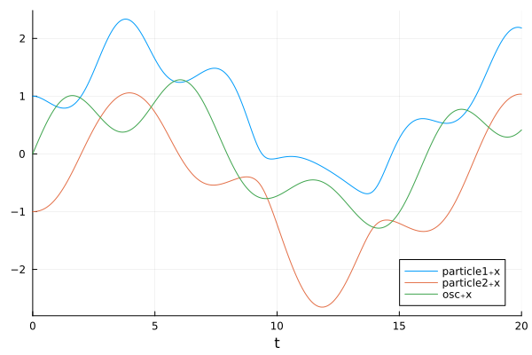

# GraphDynamics.jl

GraphDynamics.jl is a tool for describing the dynamics of interacting collections of modular subsystems
in an efficient, and parallelizable way. The current main use-case of this package is as a backend for
[Neuroblox.jl](https://www.neuroblox.org/).

More thorough docs are coming soon, but here's a demo of solving a differential equation using GraphDynamics.jl:

______


First, lets define two different types of subsystems we might want to implement:

+ `Particle` which describes a freely moving particle in 1D
+ `Oscillator` which describes a particle anchored to a spring at a point `x₀`.

We'll do this by defining structs to label these two types of subsystems, teach GraphDynamics how to construct `Subsystem`s from them,
and then add methods to the function `GraphDynamics.subsystem_differential` to describe their dynamics.

Construct a type `Particle` representing a particle with mass `m` and charge `q`
``` julia
using GraphDynamics
using Base: @kwdef
@kwdef struct Particle
    name::Symbol 
    m::Float64
    q::Float64=1.0
    x_init::Float64 = 0.0
    v_init::Float64 = 0.0
end
function GraphDynamics.to_subsystem(p::Particle)
    # Unpack the fields of the Particle
    (;name, m, q, x_init, v_init) = p
    # Set the initial states to `x_init` and `v_init`
    states = SubsystemStates{Particle}(;
        x = x_init,
        v = v_init,
    )
    # Use `name`, `m`, and `q` as parameters
    # Every subsystem should have a unique name symbol.
    params = SubsystemParams{Particle}(
        ;m,
        q,
    )
    # Assemble a Subsystem
    Subsystem(states, params)
end

GraphDynamics.initialize_input(::Subsystem{Particle}) = (; F=0.0) # Default force on a `Particle` is 0.0
function GraphDynamics.subsystem_differential(sys::Subsystem{Particle}, input, t)
    (;x, v, m, q) = sys
    (;F) = input # Force `F` is the input to the subsystem
    dx = v   # Derivative of x is just v
    dv = F/m # Derivative of v is F/m (from F = m*a where a = dv/dt)
    
    # Return the differential of the current state:
    SubsystemStates{Particle}(;x=dx, v=dv) 
end
```

Now we construct a type `Oscillator` which represents a particle attached to a spring anchored at `x₀` with spring constant `k`

```julia
@kwdef struct Oscillator
    name::Symbol
    m::Float64
    x₀::Float64
    k::Float64
    q::Float64=1.0
    x_init = 0.0
    v_init = 0.0
end
function GraphDynamics.to_subsystem(p::Oscillator)
    # Unpack the fields of the Oscillator
    (;name, m, x₀, k, q, x_init, v_init) = p
    # Set the initial states to `x_init` and `v_init`
    states = SubsystemStates{Oscillator}(;
        x = x_init,
        v = v_init,
    )
    # Use `name`, `m`, `k`, `x₀`, and `q` as parameters
    # Every subsystem should have a unique name symbol.
    params = SubsystemParams{Oscillator}(
        ;m,
        k,
        x₀,
        q,
    )
    Subsystem(states, params)
end
GraphDynamics.initialize_input(::Subsystem{Oscillator}) = (; F = 0.0)
function GraphDynamics.subsystem_differential(sys::Subsystem{Oscillator}, input, t)
    (;x, v, x₀, m, k) = sys
    (;F) = input # Force `F` is the input to the subsystem
    dx = v                   # Derivative of x is just v
    dv = (F - k*(x - x₀))/m  # Derivative of v is the acceleration due to the input force, and the acceleration due to the spring.
    SubsystemStates{Oscillator}(;x=dx, v=dv)
end
```

And now lets define some different types of 'connections' through which these subsystems can interact:
+ `Spring` which describes two objects being joined together by a spring.
+ `Coulomb` which descrbies two objects repelling eachother by a 1/r^2 law.

``` julia
struct Spring <: ConnectionRule
    k::Float64
end

function ((;k)::Spring)(src::Subsystem, dst::Subsystem, t)
    # Calculate the force on subsystem `dst` due to being connected with
    # subsystem `src` by a spring with spring constant `k`.
    F = k * (src.x - dst.x)
    # Return the `input` being sent to the `dst` subsystem
    return (; F)
end
```

``` julia
struct Coulomb <: ConnectionRule end

function (::Coulomb)(src::Subsystem, dst::Subsystem, t)
    # Calculate the Coulomb force on subsystem `dst` due to the charge of subsystem `src`
    F = -src.q * dst.q * sign(src.x - dst.x)/(abs(src.x - dst.x))^2
    # Return the `input` being sent to the `dst` subsystem
    return (; F)
end
```

Now, lets suppose we want two `Particle`s and one `Oscillator`

``` julia
particle1 = Particle(name=:particle1, x_init= 1.0, v_init=0.0, m=1.0, q=1.0)
particle2 = Particle(name=:particle2, x_init=-1.0, v_init=0.0, m=2.0, q=1.0)
osc = Oscillator(name=:osc, x_init=0.0, v_init=1.0, m=3.0, x₀=0.0, k=1.0)
# Note, each object must have a unique name field!
```

Lets create a `GraphSystem` where each particle is connected to the `osc` by a `Spring` connection:


``` julia
g = GraphSystem()

# Connect particles to osc
add_connection!(g, particle1 => osc; conn=Spring(1))
add_connection!(g, particle2 => osc; conn=Spring(1))

# Newton's third law! also need equal and opposite connections from osc to the particles
add_connection!(g, osc => particle1; conn=Spring(1))
add_connection!(g, osc => particle2; conn=Spring(1)) 
```
and lets make the particles repel eachother with a Coulomb repulsion
``` julia
add_connection!(g, particle1 => particle2; conn=Coulomb())
add_connection!(g, particle2 => particle1; conn=Coulomb())
```

We can now solve, and plot the system's solution like so:

```julia
using OrdinaryDiffEq, Plots
tspan = (0.0, 20.0)
prob = ODEProblem(g, [], tspan)

sol = solve(prob, Tsit5())

plot(sol, idxs=[:particle1₊x, :particle2₊x, :osc₊x])
```


